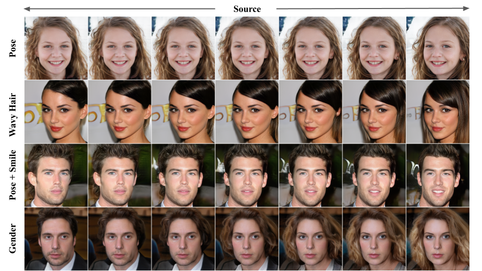

# TransEditor: Transformer-Based Dual-Space GAN for Highly Controllable Facial Editing (CVPR 2022)


 
This repository provides the official PyTorch implementation for the following paper:

**TransEditor: Transformer-Based Dual-Space GAN for Highly Controllable Facial Editing**<br>
[Yanbo Xu](https://github.com/BillyXYB)\*, [Yueqin Yin](https://github.com/yinyueqin)\*, [Liming Jiang](https://liming-jiang.com/), [Qianyi Wu](https://qianyiwu.github.io), [Chengyao Zheng](https://github.com/daili0015), [Chen Change Loy](https://www.mmlab-ntu.com/person/ccloy/), [Bo Dai](http://daibo.info/), [Wayne Wu](https://wywu.github.io/)<br>
In CVPR 2022. (* denotes equal contribution)<br>
[**Project Page**](https://billyxyb.github.io/TransEditor/) | [**Paper**](https://arxiv.org/abs/2203.17266)

> **Abstract:** *Recent advances like StyleGAN have promoted the growth of controllable facial editing. To address its core challenge of attribute decoupling in a single latent space, attempts have been made to adopt dual-space GAN for better disentanglement of style and content representations. Nonetheless, these methods are still incompetent to obtain plausible editing results with high controllability, especially for complicated attributes. In this study, we highlight the importance of interaction in a dual-space GAN for more controllable editing. We propose TransEditor, a novel Transformer-based framework to enhance such interaction. Besides, we develop a new dual-space editing and inversion strategy to provide additional editing flexibility. Extensive experiments demonstrate the superiority of the proposed framework in image quality and editing capability, suggesting the effectiveness of TransEditor for highly controllable facial editing.*

## Requirements

A suitable [Anaconda](https://docs.anaconda.com/anaconda/install/) environment named `transeditor` can be created and activated with:

```
conda env create -f environment.yaml
conda activate transeditor
```

## Dataset Preparation

| Datasets | [CelebA-HQ](https://docs.google.com/uc?export=download&id=1R72NB79CX0MpnmWSli2SMu-Wp-M0xI-o) | [Flickr-Faces-HQ (FFHQ)](https://github.com/NVlabs/ffhq-dataset) | 
| :--- | :---: | :---: |

- You can use [download.sh in StyleMapGAN](https://github.com/naver-ai/StyleMapGAN/blob/main/download.sh) to download the CelebA-HQ dataset raw images and create the LMDB dataset format, similar for the FFHQ dataset.

## Download Pretrained Models

- The pretrained models can be downloaded from [TransEditor Pretrained Models](https://hkustconnect-my.sharepoint.com/:f:/g/personal/yxubu_connect_ust_hk/EvKIlqMewWJEncEOYiUtTCwBUY2FTuJPv8lAx7UPVD33TA?e=znM6z6).
- The age classifier and gender classifier for the FFHQ dataset can be found at [pytorch-DEX](https://github.com/siriusdemon/pytorch-DEX/tree/master/dex/pth).
- The `out/` folder and `psp_out/` folder should be put under the `TransEditor/` root folder, the `pth/` folder should be put under the `TransEditor/our_interfaceGAN/ffhq_utils/dex` folder.


## Training New Networks

To train the TransEditor network, run 

```bash
python train_spatial_query.py $DATA_DIR --exp_name $EXP_NAME --batch 16 --n_sample 64 --num_region 1 --num_trans 8
```

For the multi-gpu distributed training, run

```bash
python -m torch.distributed.launch --nproc_per_node=$GPU_NUM --master_port $PORT_NUM train_spatial_query.py $DATA_DIR --exp_name $EXP_NAME --batch 16 --n_sample 64 --num_region 1 --num_trans 8
```

To train the encoder-based inversion network, run

```bash
# FFHQ
python psp_spatial_train.py $FFHQ_DATA_DIR --test_path $FFHQ_TEST_DIR --ckpt .out/transeditor_ffhq/checkpoint/790000.pt --num_region 1 --num_trans 8 --start_from_latent_avg --exp_dir $INVERSION_EXP_NAME --from_plus_space 

# CelebA-HQ
python psp_spatial_train.py $CELEBA_DATA_DIR --test_path $CELEBA_TEST_DIR --ckpt ./out/transeditor_celeba/checkpoint/370000.pt --num_region 1 --num_trans 8 --start_from_latent_avg --exp_dir $INVERSION_EXP_NAME --from_plus_space 
```

## Testing (Image Generation/Interpolation)

```bash
# sampled image generation
python test_spatial_query.py --ckpt ./out/transeditor_ffhq/checkpoint/790000.pt --num_region 1 --num_trans 8 --sample

# interpolation
python test_spatial_query.py --ckpt ./out/transeditor_ffhq/checkpoint/790000.pt --num_region 1 --num_trans 8 --dat_interp
```

## Inversion

We provide two kinds of inversion methods.

<b>Encoder-based inversion</b>

```bash
# FFHQ
python dual_space_encoder_test.py --checkpoint_path ./psp_out/transeditor_inversion_ffhq/checkpoints/best_model.pt --output_dir ./projection --num_region 1 --num_trans 8 --start_from_latent_avg --from_plus_space --dataset_type ffhq_encode --dataset_dir /dataset/ffhq/test/images

# CelebA-HQ
python dual_space_encoder_test.py --checkpoint_path ./psp_out/transeditor_inversion_celeba/checkpoints/best_model.pt --output_dir ./projection --num_region 1 --num_trans 8 --start_from_latent_avg --from_plus_space --dataset_type celebahq_encode --dataset_dir /dataset/celeba_hq/test/images
```

<b>Optimization-based inversion</b>

```bash
# FFHQ
python projector_optimization.py --ckpt ./out/transeditor_ffhq/checkpoint/790000.pt --num_region 1 --num_trans 8 --dataset_dir /dataset/ffhq/test/images --step 10000

# CelebA-HQ
python projector_optimization.py --ckpt ./out/transeditor_celeba/checkpoint/370000.pt --num_region 1 --num_trans 8 --dataset_dir /dataset/celeba_hq/test/images --step 10000
```

## Image Editing

- The attribute classifiers for CelebA-HQ datasets can be found in [celebahq-classifiers](http://latent-composition.csail.mit.edu/other_projects/gan_ensembling/zips/pretrained_classifiers.zip). 
- Rename the folder as `pth_celeba` and put it under the `our_interfaceGAN/celeba_utils/` folder.


| CelebA_Attributes |attribute_index |
| :--- | :---: | 
| Male |0 |
| Smiling |1 |
| Wavy hair |3 |
| Bald |8 |
| Bangs |9 |
| Black hair |12 |
| Blond hair |13 |

For sampled image editing, run

```bash
# FFHQ
python our_interfaceGAN/edit_all_noinversion_ffhq.py --ckpt ./out/transeditor_ffhq/checkpoint/790000.pt --num_region 1 --num_trans 8 --attribute_name pose --num_sample 150000 # pose
python our_interfaceGAN/edit_all_noinversion_ffhq.py --ckpt ./out/transeditor_ffhq/checkpoint/790000.pt --num_region 1 --num_trans 8 --attribute_name gender --num_sample 150000 # gender

# CelebA-HQ
python our_interfaceGAN/edit_all_noinversion_celebahq.py --ckpt ./out/transeditor_celeba/checkpoint/370000.pt --attribute_index 0 --num_sample 150000 # Male
python our_interfaceGAN/edit_all_noinversion_celebahq.py --ckpt ./out/transeditor_celeba/checkpoint/370000.pt --attribute_index 3 --num_sample 150000 # wavy hair
python our_interfaceGAN/edit_all_noinversion_celebahq.py --ckpt ./out/transeditor_celeba/checkpoint/370000.pt --attribute_name pose --num_sample 150000 # pose
```

For real image editing, run

```bash
# FFHQ
python our_interfaceGAN/edit_all_inversion_ffhq.py --ckpt ./out/transeditor_ffhq/checkpoint/790000.pt --num_region 1 --num_trans 8 --attribute_name pose --z_latent ./projection/encoder_inversion/ffhq_encode/encoded_z.npy --p_latent ./projection/encoder_inversion/ffhq_encode/encoded_p.npy # pose

python our_interfaceGAN/edit_all_inversion_ffhq.py --ckpt ./out/transeditor_ffhq/checkpoint/790000.pt --num_region 1 --num_trans 8 --attribute_name gender --z_latent ./projection/encoder_inversion/ffhq_encode/encoded_z.npy --p_latent ./projection/encoder_inversion/ffhq_encode/encoded_p.npy # gender

# CelebA-HQ
python our_interfaceGAN/edit_all_inversion_celebahq.py --ckpt ./out/transeditor_celeba/checkpoint/370000.pt --attribute_index 0 --z_latent ./projection/encoder_inversion/celebahq_encode/encoded_z.npy --p_latent ./projection/encoder_inversion/celebahq_encode/encoded_p.npy # Male
```

## Evaluation Metrics

```bash
# calculate fid, lpips, ppl
python metrics/evaluate_query.py --ckpt ./out/transeditor_ffhq/checkpoint/790000.pt --num_region 1 --num_trans 8 --batch 64 --inception metrics/inception_ffhq.pkl --truncation 1 --ppl --lpips --fid
```


## Results

### Image Interpolation

**interp_p_celeba**


**interp_z_celeba**


### Image Editing

**edit_pose_ffhq**


**edit_gender_ffhq**


**edit_smile_celebahq**


**edit_blackhair_celebahq**


## Citation

If you find this work useful for your research, please cite our paper:

```bibtex
@inproceedings{xu2022transeditor,
  title={{TransEditor}: Transformer-Based Dual-Space {GAN} for Highly Controllable Facial Editing},
  author={Xu, Yanbo and Yin, Yueqin and Jiang, Liming and Wu, Qianyi and Zheng, Chengyao and Loy, Chen Change and Dai, Bo and Wu, Wayne},
  booktitle={Proceedings of the IEEE/CVF Conference on Computer Vision and Pattern Recognition},
  year={2022}
}
```

## Acknowledgments

The code is developed based on [TransStyleGAN](https://github.com/AnonSubm2021/TransStyleGAN). We appreciate the nice PyTorch implementation.
